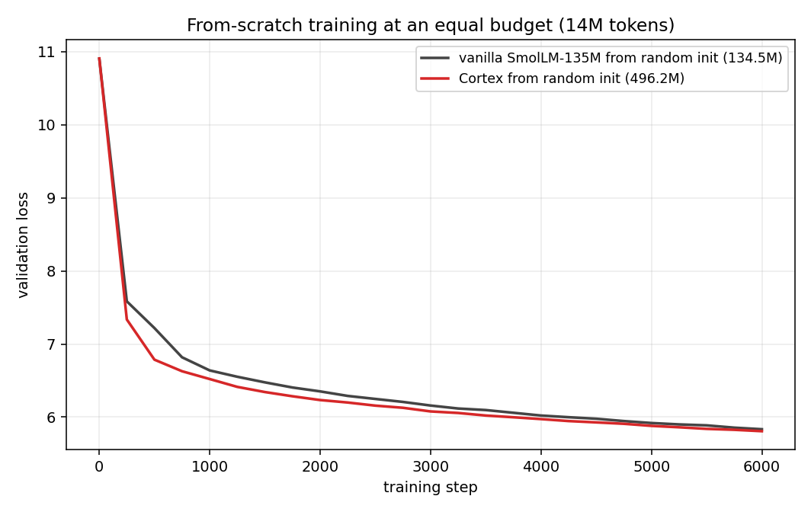
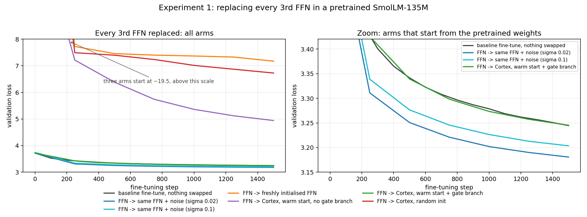
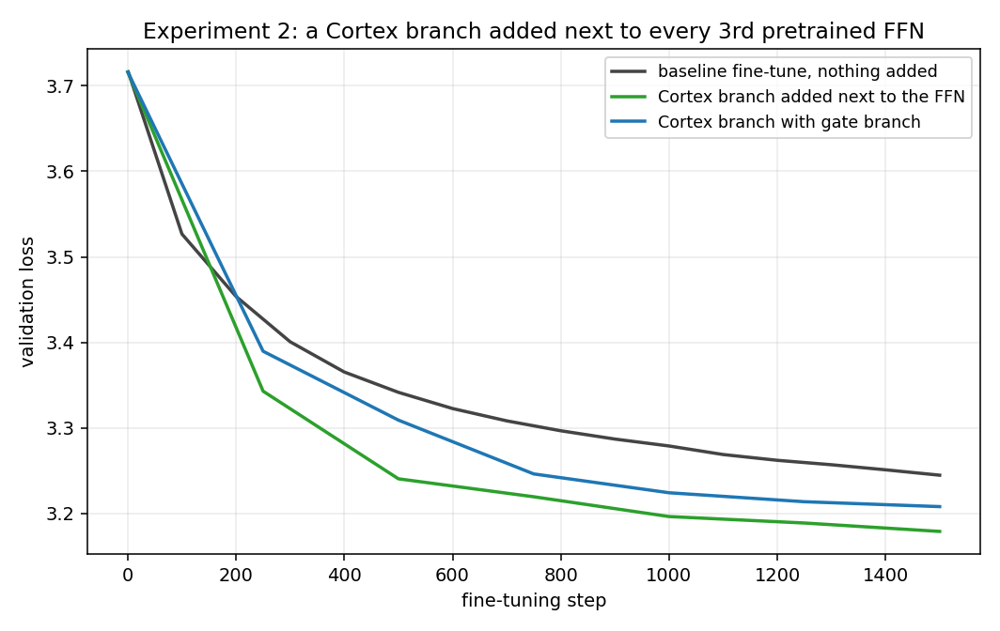
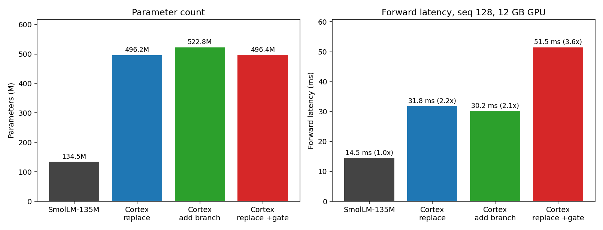

# Cortex

FFN, который генерирует веса для каждого токена отдельно, плюс адаптивная глубина: блок сам решает, доработать токен или нет. Эксперимент поверх SmolLM-135M.

[Read in English](README.md)

**Коротко:** блок обучается, вставляется в готовую модель без потери качества, но лучше обычного FFN не становится. Видимую прибавку в 0.06 loss даёт сам шум в весах: если заменить те же FFN на их же веса плюс шум, получается ровно столько же. При этом параметров у неё в 3.7 раза больше, а работает она в 2.2 раза дольше (а вариант, который и правда может встать на место FFN, — в 3.5 раза дольше). Разбор двух опытов — в [RESEARCH_RU.md](RESEARCH_RU.md).

**Оговорка про цифры.** Я не до конца уверен, насколько им можно верить: обучение, возможно, было слишком коротким, а выборка текста (кусок старого дампа Википедии) — не самой удачной. На 6000 шагах обе кривые ещё ползут вниз, так что различия ниже — это разница в скорости обучения на коротком отрезке, а не финальное качество архитектур. Читайте это как первую прикидку энтузиаста, а не как строгое исследование.

**Год:** ноябрь 2025, мой ранний эксперимент с архитектурой нейросетей. Дообучен и измерен по-настоящему в сентябре 2026.



## Что это

Обычный FFN применяет к каждому токену одни и те же веса. Cortex вместо этого собирает веса для каждого токена заново. Маленькая сеть смотрит на токен и решает:

- какую долю токена вообще пустить в блок;
- как смешать 16 общих базисных матриц, чтобы получилась своя верхняя проекция;
- какую небольшую поправку к весам добавить (в стиле LoRA), какой сдвиг и какое усиление нейронов применить;
- сколько раз доработать токен: ни разу, один раз или два.

Последний пункт и есть адаптивная глубина. Есть ещё необязательная gate-ветка: она позволяет блоку повторить SwiGLU-FFN модели. Без неё блок не может встать на место обученного FFN — его выход отличается по масштабу в 9 раз.

## Что получилось

Два опыта на готовой SmolLM-135M, одинаковый бюджет (1500 шагов, 14 млн токенов), loss на проверочных данных:

| Что сделали | В начале | В конце |
|---|---|---|
| Ничего, обычное дообучение | 3.7161 | **3.2446** |
| **Замена:** 1/3 FFN → Cortex со случайными весами | 19.54 | 6.7282 |
| **Замена:** Cortex инициализирован из FFN, без gate-ветки | 12.5551 | 4.9426 |
| **Замена:** Cortex инициализирован из FFN, с gate-веткой | 3.7161 | **3.2453** |
| **Замена, контроль:** 1/3 FFN → свои же веса плюс шум | 3.7154 | **3.1807** |
| **Добавление:** Cortex-ветка рядом с FFN | 3.7161 | **3.1788** |
| **Добавление:** то же с gate-веткой | 3.7161 | 3.2078 |

- Случайный Cortex на месте FFN ломает модель, и за 1500 шагов она не восстанавливается.
- С правильной инициализацией замена проходит гладко, но даёт ровно то же, что обычное дообучение: 3.2453 против 3.2446.
- Добавление ветки даёт 3.1788 — столько же, сколько шум в весах FFN (3.1807). Похоже, дело в возмущении весов, а не в архитектуре.
- Прогон с нуля на 6000 шагов: Cortex (496M) 5.807 против обычной модели (134.5M) 5.834 — вровень.
- Адаптивная глубина работает: 33.2% токенов не дорабатываются, 41.8% дорабатываются один раз, 24.9% — дважды.





## Файлы

- `cortex_model.py` — блок Cortex, gate-ветка, инициализация из заменяемого FFN, процедуры замены и добавления ветки, классы моделей.
- `train.py` — обучение в трёх режимах: добавить ветку, заменить FFN, учить с нуля.
- `chat.py` — простой чат в терминале для обученного чекпоинта.
- `RESEARCH_RU.md` / `RESEARCH.md` — полное описание: два опыта, метод, результаты, что не проверено.
- `docs/` — графики.

## Как запустить

```bash
pip install -r requirements.txt

python train.py --data wiki.txt --mode add                  # ветка рядом с FFN
python train.py --data wiki.txt --mode replace --warm-start # замена 1/3 FFN
python train.py --data wiki.txt --mode scratch              # с нуля

python chat.py                    # чекпоинт из обучения с нуля (текст бессмысленный, см. «Статус»)
python chat.py smollm-cortex-add  # чекпоинт из опыта с добавлением ветки — связный английский
```

Чекпоинт после обучения открывается обычным `AutoModelForCausalLM.from_pretrained(..., trust_remote_code=True)` — нужный класс подхватывается сам через `auto_map`.

Сами веса в репозиторий не входят: чекпоинты лежат локально (`cortex-long-fixed` ~950 МБ и `cortex-parallel-ckpt` ~1 ГБ) и подключены симлинками `smollm-cortex` и `smollm-cortex-add`.

## Статус

Это исследование, а не готовая модель. Чекпоинт из прогона с нуля (6000 шагов) выдаёт текст, похожий на английский по форме, но бессмысленный по содержанию. Веса в репозиторий не входят — это примерно 950 МБ, они лежат локально и подключаются симлинком `smollm-cortex`. По ходу работы нашлись ошибки в коде и в подготовке данных, из-за которых первые опубликованные числа были завышены. Всё переделано, числа на этой странице — уже после исправлений.

## Лицензия

MIT

---

P.S. Текст README отредактирован нейросетью — содержание и смысл за автором.
