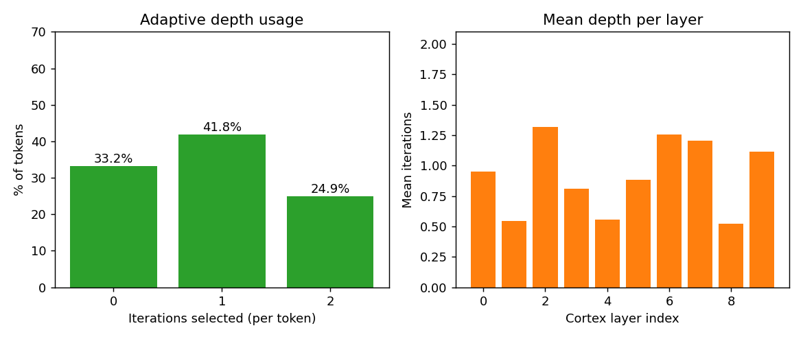

# Cortex: an FFN that builds its own weights for every token

**Author:** Nazar Ponomarenko · **Original experiment:** November 2025 · **Everything redone:** September 2026

## The short version

A normal FFN in a transformer uses the same weights for every token. Cortex does it differently: a small network generates the weights for each token on the fly. The same network also decides how many times to rework that token — zero, one or two times.

We tried two ways of putting this block into a pretrained SmolLM-135M. The first one: take out some of the normal FFNs and put Cortex in their place. The second one: leave the FFNs alone and add Cortex next to them. Both train. Neither gets better than the plain FFN, and it has 3.7× the parameters while running 2.2× longer.

Four numbers tell most of the story:

- Put Cortex in place of an FFN with random weights and the model breaks: loss jumps from 3.72 to 19.5, and 1500 training steps only bring it back to 6.73.
- Initialise the block so that it copies the FFN it replaces and everything goes smoothly: training starts at the same 3.7161 and ends at 3.2453 against 3.2446 for plain fine-tuning. Nothing extra at all.
- The control experiment: replace those same FFNs not with Cortex but with their own weights plus noise. That gives 3.1807 — better than the baseline and better than every Cortex variant.
- Train both architectures from scratch and they run level: 5.807 for Cortex against 5.834 for the plain model after 6000 steps, at 3.7× the weight.

The gain visible here seems to come from interfering with the weights at all, not from the architecture. Once we account for that, the difference goes away.

## 1. Why bother

The FFN in a transformer is two matrices applied to every token in the same way. There are various attempts to change that: mixture-of-experts sends different tokens to different stored matrices, adaptive computation time (Graves, 2016) runs the computation a variable number of times. Cortex goes further: instead of picking from ready-made matrices, it builds a new one for each token out of a shared set.

We wanted to know three things:

1. Can such a block be put in place of a trained FFN without breaking the model?
2. Does it learn better than a plain FFN on the same budget?
3. What does it cost, and does the model actually use the adaptive depth?

## 2. How the block works

A small network (we call it the context head) looks at a token and emits a set of signals:

| Signal | What it does |
|---|---|
| input gate | decides how much of the token enters the block |
| mixture weights | decides how to mix 16 shared basis matrices |
| LoRA A and B | a small weight correction, its own for each token |
| neuron scalers | a gain for each neuron after the activation |
| shift | its own bias for each token |
| depth signal | how many times to rework the token: 0, 1 or 2 |

The up-projection works like this: take the 16 basis matrices and mix them with the weights the context head produced. That gives one matrix per token. Then add the LoRA correction and the bias, apply SiLU, multiply by the scalers, and run the result through a separate refinement block once or twice. Finally a projection back to the model's width.

### 2.1 Why we needed a gate branch

The first version of the block computed `silu(W_up·x)`, while the model's own FFN computes `silu(W_gate·x)·(W_up·x)`. That difference is not cosmetic: we measured that the block's output differs from the original FFN by 94% in norm and is 9× smaller in scale. So it cannot simply be dropped in place of an FFN.

In the second version we added a second mixture over the same basis matrices. The block gained only 16 extra numbers, and the formula became `silu(W_gate·x)·(W_up·x + LoRA + bias)·scaler`. With this branch, the right initialisation copies the original FFN exactly.

### 2.2 What it costs

For SmolLM-135M (576 numbers per token, 1536 inside the FFN) one context head is about 19M parameters, and the bank of basis matrices is another 14M. A plain FFN weighs 1.8M. Put Cortex in all 30 layers and the model grows from 135M parameters to 2.1B.

We put the block in every third layer, that is 10 out of 30. Replacing gives 496.2M parameters, adding a branch gives 522.8M.

## 3. How we trained everything

- **Model:** HuggingFaceTB/SmolLM-135M, 30 layers.
- **Data:** 14M tokens from a Wikipedia dump, 95% for training, 5% for validation.
- **Recipe:** 1500 steps (6000 in one long run), chunks of 128 tokens, batch 2 with gradient accumulation 4, bf16, 8-bit AdamW, lr 1e-4, gradient clipping 1.0, seed 0. Every variant was trained the same way on the same data.
- **Baseline:** the same model and the same recipe, but with nothing touched inside it.
- **Hardware:** one home GPU with 12 GB.

## 4. Experiment 0: training from scratch

First a simple check. Both architectures start from random weights.

| | 1500 steps | 6000 steps | Parameters | Forward time (128 tokens) |
|---|---|---|---|---|
| Plain SmolLM-135M | 6.4755 | 5.8344 | 134.5M | 14.5 ms |
| Cortex in every third layer | 6.3585 | 5.8073 | 496.2M | 31.8 ms |

At 1500 steps Cortex is slightly ahead (6.359 vs 6.476), at 6000 steps it is 5.807 vs 5.834. The model trains and does not fall apart. But it has 3.7× the parameters and runs 2.2× longer for no gain at all — you cannot call that a success.

## 5. Experiment 1: replacing part of the FFN stack

We swap every third FFN (10 of 30) and fine-tune for 1500 steps. The variants differ only in what we put in place of those FFNs.

| What sits in place of the 10 FFNs | Loss at the start | Loss at the end |
|---|---|---|
| Nothing, plain fine-tuning | 3.7161 | **3.2446** |
| The same FFN plus noise, σ=0.02 | 3.7154 | **3.1807** |
| The same FFN plus noise, σ=0.1 | 3.7416 | **3.2035** |
| A new random FFN | 19.5446 | 7.1742 |
| Cortex with random weights | 19.54 (sometimes NaN) | 6.7282 |
| Cortex initialised from the FFN, no gate branch | 12.5551 | 4.9426 |
| Cortex initialised from the FFN, with gate branch | 3.7161 | **3.2453** |

Here is what it shows.

**Random weights do not fit a pretrained model.** It does not matter what we put in — a new FFN or Cortex. Loss jumps to 19.5 and does not come back within 1500 steps. A pretrained model holds together through representations that agree across layers, and ten foreign blocks break them.

**Without the gate branch Cortex cannot replace an FFN even with good initialisation.** We set it up to copy the up- and down-projections of the original FFN. It still starts at 12.56 and reaches only 4.94 after 1500 steps — worse than not touching anything.

**With the gate branch the block becomes a proper replacement — and that buys nothing.** The start matches the baseline (3.7161) and the end is 3.2453 against 3.2446. Cortex initialised as the original FFN learns exactly as well as the original FFN. A difference of 0.0007 is noise.

**Plain perturbation of the weights works better than the hypernetwork.** We replaced those same FFNs with their own weights plus noise and got 3.1807 and 3.2035. That is better than the baseline (3.2446) and better than any Cortex variant in replacement mode. So the 0.06–0.07 of loss available here comes from regular perturbation of the weights, not from generating weights per token.

**The gate branch is expensive.** Forward time on 128 tokens: baseline 14.5 ms, replacement without the gate branch 31.8 ms, replacement with the gate branch 51.5 ms. The second mixture is another multiplication by matrices that are different for every token. The variant that can actually stand in for an FFN runs 3.5× longer than the model it replaces.

### 5.1 Why it failed without the gate branch

We fed the block the real input of a real layer and compared its output with the output of the original FFN.

| | Difference from the original FFN | Spread of the output |
|---|---|---|
| Cortex initialised from the FFN, no gate branch | 0.938 | 84.5 |
| Just `down(silu(up(x)))` | 0.938 | — |
| The original FFN | 0 | 776.0 |

The block without a gate branch copies `down(silu(W_up·x))` exactly — the same difference as our hand-written check. But that is not SwiGLU: the output is 9× smaller in scale, and that is what wrecks the layer. No initialisation can fix it, because the necessary part is simply missing from the block. With the gate branch the initialisation error becomes zero and the start is 3.7161.

## 6. Experiment 2: adding a branch

The second way is not to remove the FFN but to put Cortex next to it: `FFN(x) + Cortex(x)`. We zeroed the branch's output so that at the start the model is exactly what it was.

| What is added | Loss at the start | Loss at the end |
|---|---|---|
| Nothing, plain fine-tuning | 3.7161 | **3.2446** |
| A Cortex branch next to the FFN | 3.7161 | **3.1788** |
| A Cortex branch with the gate branch | 3.7161 | 3.2078 |

At the start the loss matches the untouched model to four decimals: a zeroed branch breaks nothing. At the end it is 3.1788, which is 0.066 better than plain fine-tuning. Noise in the FFN weights gives exactly as much (0.064), and that is the main argument against an optimistic reading: here the hypernetwork behaves like an expensive perturbation.

The variant with the gate branch did worse (3.2078, a gain of 0.037) and landed closer to the σ=0.1 noise (3.2035). There is no link between how "rich" the block is and the result: once we account for the noise, every Cortex variant matches it within error. And the comparison is not fair on cost either — 522.8M parameters against 134.5M.

## 7. Adaptive depth

On the trained checkpoint (from scratch, 1500 steps) the depth mechanism switches on: 33.2% of tokens are not reworked at all, 41.8% are reworked once, 24.9% twice. Across layers the average depth wanders from 0.52 to 1.32: some blocks behave like a plain transformation, others actively rework the token.

## 8. What we did not check, and what it would change

**Take the numbers with care.** Training was short: 1500 and 6000 steps on 14M tokens. The data is a slice of an old Wikipedia dump. At 6000 steps both curves are still creeping down, so the models have not converged. That means the differences in the tables are differences in learning speed over a short stretch, not the final quality of the architectures. A long run on proper data could tell a different story.

- No Cortex variant produced a gain that noise in the FFN weights cannot produce. At this scale the extra parameters do not turn into quality.
- Replacement without the gate branch is a dead end because of how the block is built, not because of training. That is worth knowing before comparing numbers.
- We did not test the "it is just perturbation" explanation on its own: we did not sweep noise levels and did not repeat the experiment on other data.
- The LoRA correction on top of already per-token weights is a redundant layer of indirection — the first thing to remove.
- One run per variant, no repeats with other seeds. The 3.1788 against 3.1807 difference needs checking.

## 9. Conclusion

Cortex showed that an FFN which builds weights for every token can be built, trained and loaded with ordinary HuggingFace tools. It can be inserted into a pretrained model cleanly — and it gives nothing beyond a plain FFN. The gain visible in the branch experiment comes from perturbing the weights: once we account for that, the difference disappears.

What the project left behind: a working implementation with two ways of inserting the block, an exact SwiGLU initialisation for it, and a measured cost — for whoever goes next.
